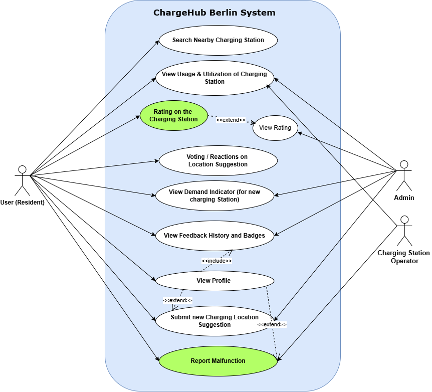
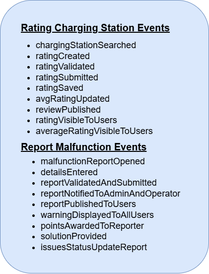
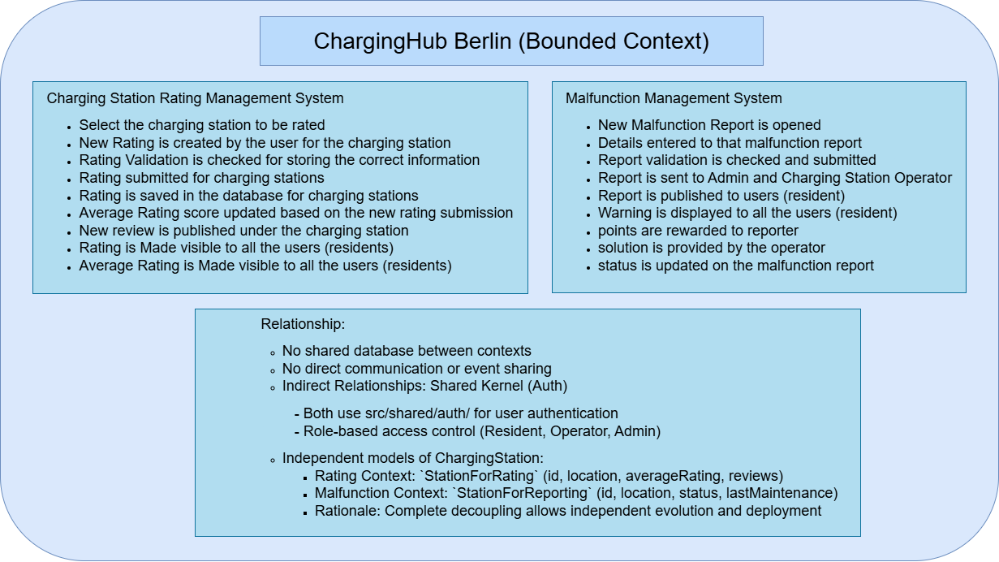
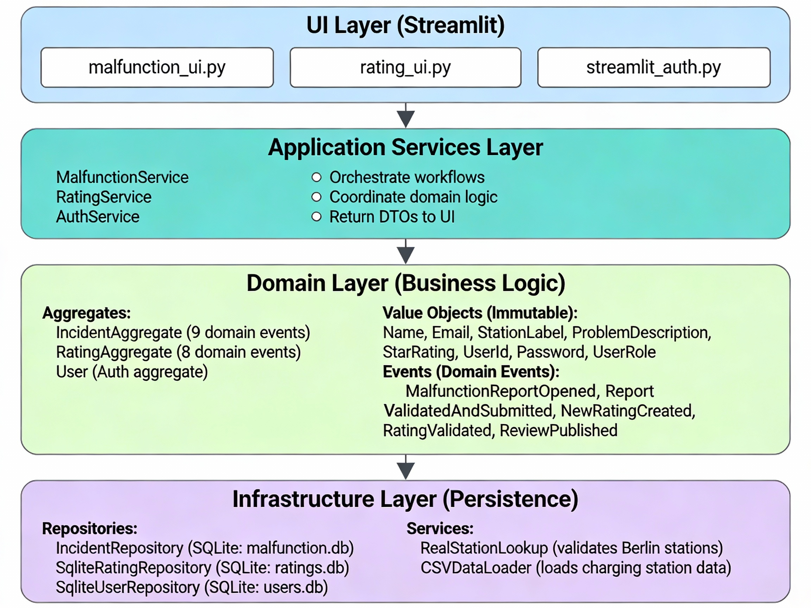
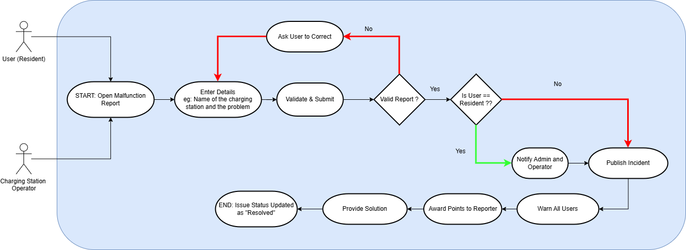
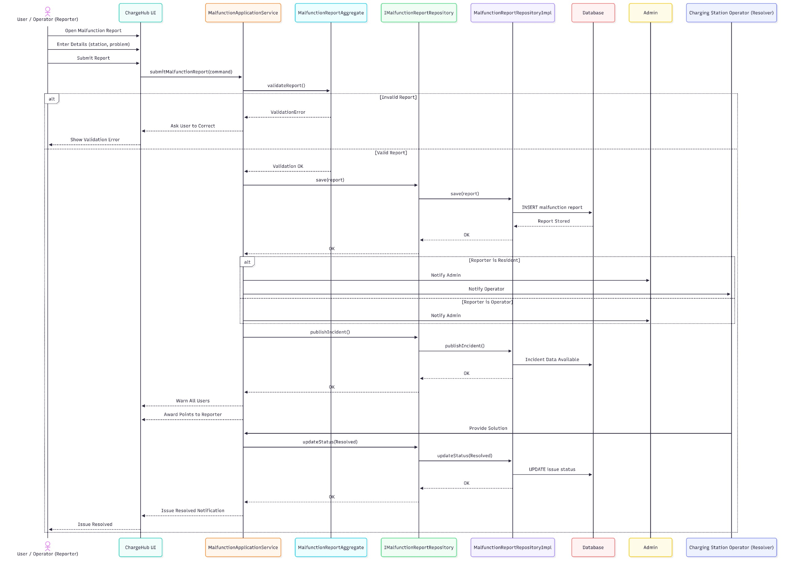
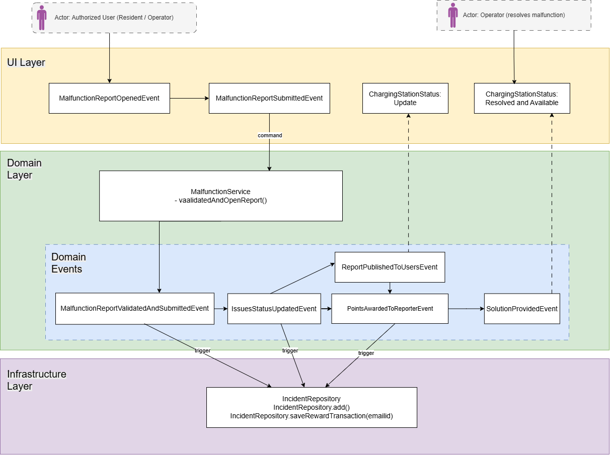
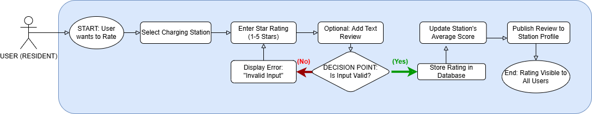
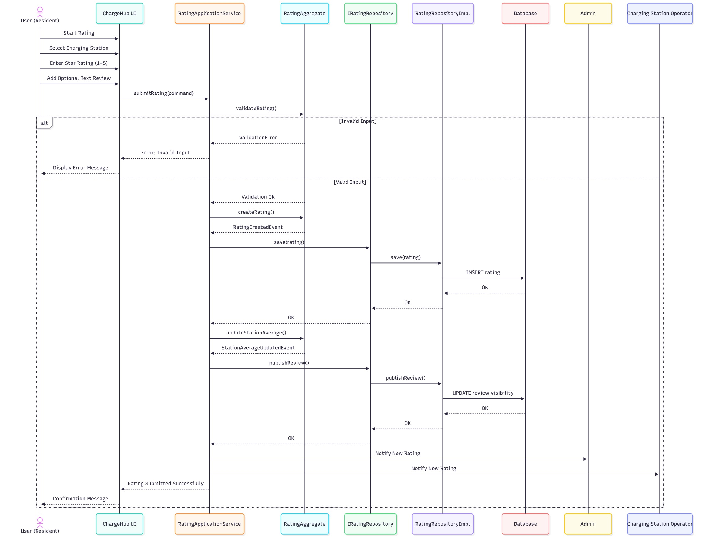
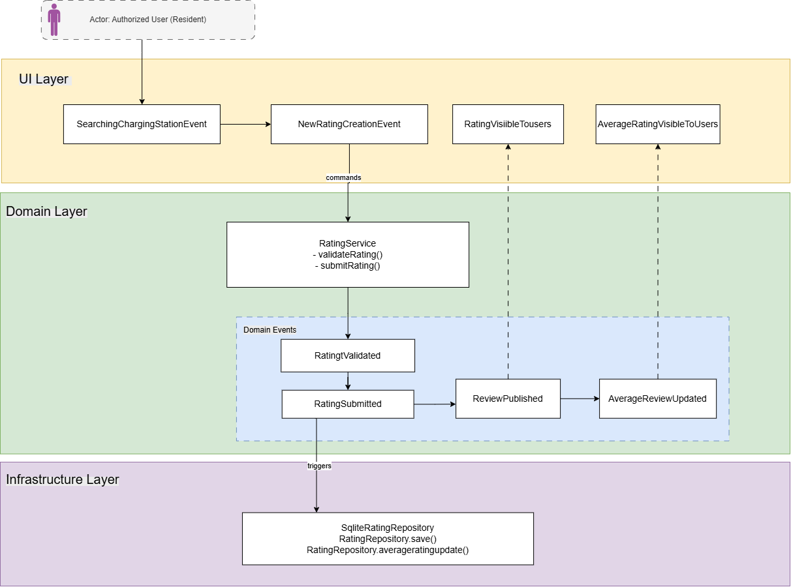

# ChargeHub Berlin

Streamlit portal for exploring Berlin EV charging infrastructure, reporting malfunctions, and rating stations. The app combines geospatial heatmaps, crowdsourced ratings, and operator/admin workflows on top of lightweight SQLite storage.

## Live Demo: https://charging-app-station.streamlit.app/

## Features
- Berlin charging heatmap with resident density and station power filters.
- Ratings hub for logged-in users; operators and admins are view-only.
- Malfunction reporting with separate flows for users, operators, and admins, including validation/solve status tracking.
- Authentication with roles (user, operator, admin) and operator-to-station assignment.
- SQLite-backed persistence for auth, ratings, and malfunction incidents; schemas are auto-created on first run.

## Stack
- Python 3.11+ (tested on Windows)
- Streamlit, pandas, folium/streamlit-folium, sqlite3
- Pytest for unit tests

## Project layout
- `main.py` — Streamlit entrypoint and page routing (Map, Ratings, Malfunction, Admin Panel).
- `config.py` — dataset filenames and geocode configuration.
- `datasets/` — CSV and shapefile data for Berlin stations and demographics.
- `src/rating` — rating domain, services, UI, and `ratings.db` repository.
- `src/malfunction` — incident domain, services, UI, and `malfunction.db` repository.
- `src/shared/auth` — auth domain, services, and SQLite repository.
- `tests/` — pytest suites for rating and malfunction domains.

## Setup
1) Create and activate a virtualenv (recommended).
2) Install dependencies:
```bash
pip install -r requirements.txt
```
3) Seed an initial super admin (optional but recommended):
```bash
python create_admin.py
```
	- Default credentials: admin@berlin.de / 123 (change after first login).
4) Ensure the CSV files in `datasets/` remain in place; Streamlit reads them directly.

## Run the app
```bash
streamlit run main.py
```
Pages:
- Map: heatmaps of residents vs. charging stations (with kW grouping).
- Ratings: users submit reviews; operators/admins view-only.
- Malfunction: users submit reports; operators manage their station; admins manage all.
- Admin Panel: approve/reject operator signups.

## Databases
- `ratings.db` and `malfunction.db` are created automatically in the project root when first used.
- Auth storage is backed by SQLite via the shared auth repository; `create_admin.py` seeds a super admin.

## Testing
Run the domain suites:
```bash
pytest tests/src/rating/ -v
pytest tests/src/malfunction/ -v
```
## Architecture & Design Diagrams

### Use Case Diagram



<table>
  <tr>
    <th>Event Storming</th>
    <th>Bounded Context</th>
  </tr>
  <tr>
    <td>
      
    </td>
    <td>
      
    </td>
  </tr>
</table>

<!-- ### Architecture Overview
 -->

---

### Malfunction Context

**Flow Chart:**


**Sequence Diagram:**


**DDD Diagram:**


---

### Rating Context

**Flow Chart:**


**Sequence Diagram:**


**DDD Diagram:**


---
## Notes
- Only Berlin stations are exposed to users for rating/reporting (regex filter on station labels ending in “Berlin”).
- Datasets ship with the repo; no external APIs are required for the core flows.
